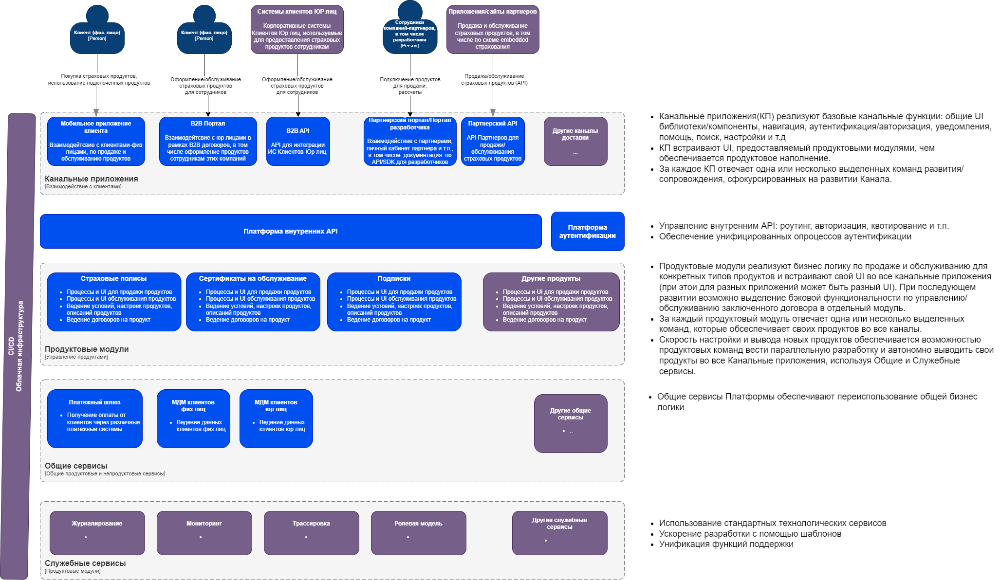
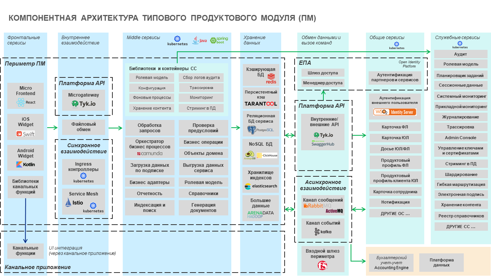
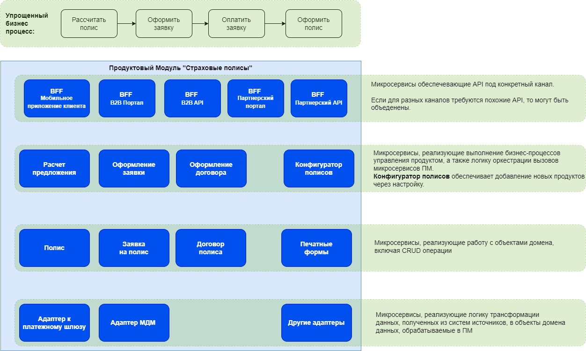

# 1. Концептуальная архитектура решения

Архитектура нацелена на максимально быстрый вывод новых продуктов, гибкость конфигурирования и продажи продуктов. 
Это достигается за счет:
- Возможности параллельного запуска требуемого количества продуктовых команд, которые сфокусированы на своих продуктах и имеют возможность максимально эффективно их выводить в Каналы доставки с обеспечением омниканальности.-
- Команды имеют возможность вести параллельную разработку независимо от других команд, не вставая в очередь к командам занятых общей функциональностью.
- Обеспечивается окружение для максимально продуктивной работы продуктовых команд:
- Канальные приложения – реализуют специфику и нефункциональные требования канала, предоставляя продуктовым командам шаблоны для вывода UI продукта
  - Общие и Служебные сервисы платформы – обеспечивают возможность использования общей бизнес и системной логики
  - Процессы CI/CD – обеспечивают быстрое развертывание и тестирование на тестовых и продуктовых средах.
  - Облачная инфраструктура с возможностью управления по модели «инфраструктура как код»
  - Конфигуратор продуктов, который обеспечивает возможность вывода новых продуктов через конфигурацию без разработки

# 2. Компонентная архитектура ПМ

## 2.1.	Типовая архитектура Продуктового модуля

## 2.2.	Описание компонентов типового Продуктового модуля (ПМ)
- **Веб-приложение (Micro Frontend)**:	Микрофроненд ПМ для встраивания в канальное приложение
- **Мобильное приложение iOS (iOS Widget)**: Виджет ПМ для встраивания в мобильное приложение для iOS
- **Мобильное приложение Android (Android Widget)**:	Виджет ПМ для встраивания в мобильное приложение для Android
- **Библиотеки канальных функций**:	Набор библиотек для интеграции микрофронтенда ПМ с функциями канального приложения, в которое он встраивается 
- **Microgateway**:	Микрошлюз для публикации внутренних API ПМ (прямая синхронная и асинхронная интеграция фронтального слоя и микросервисов в периметре ПМ - входные точки в бекенд). Микрошлюз реализует следующие функции:
  - Проверка JWT токена на валидность
  - Запрос на Anti-Replay токена - защита от подмены токена 
  - Сопоставление токена и инициатора обращения - определение типа аутентифицированного субъекта, который обращается к данному шлюзы, необходимо для реализации контроля доступа и выполнения правил интеграции
  - Обеспечение политик безопасности
  - ФЛК входящего запроса - предоставляет движок для реализации ФЛК
  - Добавление заголовков в HTTP запрос - интеграция с сессионными данными и инициализация HTTP запроса к микросервисам (простановка заголовков запроса, формат HTTP стандартный для всех сервисов)
  - Закрытие TLS в сторону микросервисов
  - Проверка роли (RBAC) для доступа к сервису - загрузка ролей пользователя из сессии (или ролевого провайдера) и проверка возможности доступа к вызываемой операции для данного субъекта по конфигурации
  - Маршрутизация по канареечным релизам - возможность маршрутизации входящего трафика по плечам и версиям сервисом по правилам маршрутизации
  - Квотирование, троттлинг и лимитирование (rate limiter) - стандартные механизмы по контролю пропускной способности и нагрузки на сервис
  - Аудит действий пользователя
  
- **Файловый обмен**:	Шлюз для обмена файлами с фронтальными сервисами, включая получение и отправку файлов, проверку на отсутствие угроз ИБ и валидацию содержимого файлов
- **Ingress контроллеры**:	Компоненты для маршрутизация входного траффика на соответствующие поды K8s кластера (включая балансировку)
- **Service Mesh**:	Выделенный слой инфраструктуры кластера K8s для обеспечения безопасного, быстрого и надежного взаимодействия между сервисами, развернутыми в кластере
- **Обработка запросов**:	Микросервисы, реализующие дополнительную логику интеграции и обработки запросов к ПМ со стороны UI и других прикладных сервисов платформы
- **Проверка предусловий**:	Реализация логики проверки обязательных условий для запуска бизнес-операции, включая проверки, специфичные для продукта в данном канале. В случае отрицательного результата проверки ПМ должен возвратить потребителю ответ о невозможности запуска бизнес-операции.
- **Оркестратор бизнес-процессов**:	Микросервисы, реализующие выполнение бизнес-процессов BPMN управления продуктом, а также логику оркестрации вызовов микросервисов ПМ.
  При использовании паттерна оркестрации управление бизнес-процессами реализовано на выделенном движке процессов (workflow engine), если необходимо:
  - сохранить экземпляры запущенных процессов, их статус и контекст между вызовами
  - запустить бизнес-процессы и/или отдельные шаги по расписанию
  - реализовать Human Task с назначением задачи сотруднику
  - версионировать бизнес-процессы (поддерживать несколько версий описания процесса одновременно)
  - разработать графическое описание бизнес-процесса в моделере и обеспечить визуализацию шагов процесса и переходов между шагами
  
  В противном случае, оркестрация реализована средствами платформы разработки и языка программирования. Движок бизнес-процессов (workflow engine) встроен в отдельный микросервис как библиотека (embedded) и хранит свое состояние в базе данных.
- **Бизнес операции**:	Микросервисы, реализующие логику операций и шагов бизнес-процесса по продаже/обслуживанию продукта в ПМ
- **Объекты домена**:	Микросервисы, реализующие работу с объектами домена, включая CRUD операции.
- **Загрузка данных по подписке**:	Загрузка и кэширование данных в ПМ, которые обрабатываются и публикуются другими сервисами в режиме онлайн (запоздание до 1 мин) и оффлайн (актуальность на T-1)
- **Выгрузка данных сервиса**:	Выгрузка данных (объектов домена) из хранилищ сервиса в Платформу Данных и другим потребителям
- **Бизнес адаптеры провайдеров**:	Микросервисы, реализующие логику трансформации данных, полученных из систем источников, в объекты домена данных, обрабатываемые в ПМ
- **Ролевая модель**:	Внутренняя ролевая модель доступа категории пользователей к функциям ПМ на основе статических и динамических правил доступа (ABAC)
- **Отчетность**:	Формирование отчетов и визуальных форм на основе информации из хранилищ данных сервиса
- **Справочники**:	Локальная копия справочников, используемых сервисом для автоматизации бизнес-процесса над продуктом Банка
- **Индексация и поиск**:	Реализация операций индексации данных из хранилищ данных сервиса и организации поиска на основе построенных индексов
- **Генерация документов**:	Формирование печатных форм в сервисе
- **Библиотеки и контейнеры служебных сервисов**:	Библиотеки, встраиваемые в микросервисы ПМ, и контейнеры (sidecar) для работы со служебными сервисами платформы, включая авторизацию на основе ролевой модели, сбор логов, трассировку, конфигурацию, , управление сессией, фоновые процессы и т.д.
- **Кэширующие БД**	
- **Персистентный кэш**	
- **Реляционная БД сервиса**
- **NoSQL БД**
- **Хранилище индексов**	
- **Большие данные**	
- **Внешние API**:	Набор сервисов, которые предоставляют партнерам единую точку входа для использования сервисов Компании
- **Внутренние API**:	Набор сервисов, которые позволяют вызывать партнерские сервисы, а также общаться модулям Платформы между собой посредством API
- **Канал сообщений**:	Обеспечение онлайн асинхронных интеграционных взаимодействий на базе очередей сообщений
- **Канал событий**:	Обеспечение потоковой обработки событий и publish-subscribe стиля интеграции
- **Входной шлюз периметра**:	Организация сетевого доступа и балансировки запросов к сервисам
- **Шлюз доступа**:	Аутентификация запросов к сервисам на основе сценариев аутентификации

## 2.3.	Критерии декомпозиции микросервисов
Микросервисы могут быть выделены по следующим критериям:
1.	Применение базовых принципов Domain-Driven Design
2.	Функциональное назначение микросервиса согласно типовой архитектура компонента ПМ, к которому он принадлежит
3.	Разная скорость внесения изменений (multiple rates of change)
4.	Независимый жизненный цикл (independent life cycle) - от коммита кода до регрессионного тестирования и поставки в промышленную эксплуатацию
5.	Независимая масштабируемость (independent scalability)
6.	Изолирование отказов (isolated failure) - изоляция функционала для снижения влияния сбоя на зависимый функционал (в этом случае могут появляться сценарии eventual consistency)
7.	Упрощение взаимодействий с внешними зависимостями (layer of indirection) - паттерн Фасад для часто меняющихся зависимостей
8.	Использование более подходящей технологии для реализации функционала - использование разных хранилищ данных для сложных сущностей приводит к разным микросервисам слоя доступа к данным

## 2.4.	Возможная декомпозиция на микросервисы продуктового модуля на примере ПМ «Страховые полисы»
Рассмотрен упрощенный процесс продажи полиса.
Описаны микросервисы, которые могут быть выделены на основе Компонентной архитектура ПМ, описанной выше.

